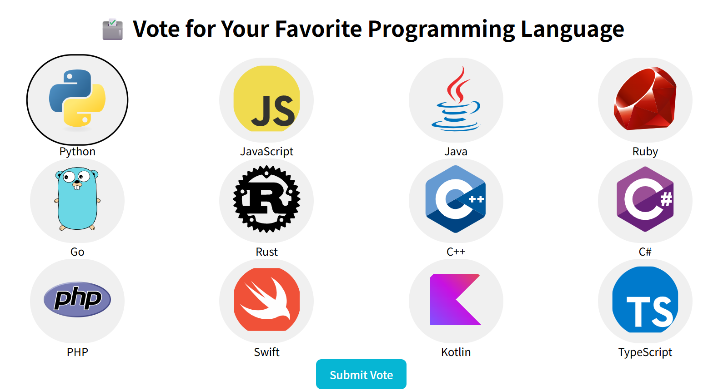
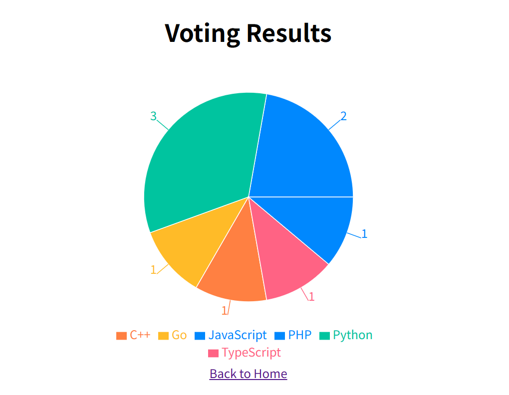

# Electronic Voting System (Blockchain-Based)

## Overview

This is a blockchain-based electronic voting system built as a personal project.  
The goal is to explore how blockchain can provide **security**, **transparency**, and **tamper resistance** in digital voting.  

The system includes **two separate backends** — one implemented in **Python (FastAPI)** and another in **Go** — allowing comparison of design and performance across languages.

## Key Features

- **Digital Signature Verification**: Voters sign their vote using a private key; the backend verifies it using the corresponding public key.
- **Block-Based Storage**: Valid votes are grouped into blocks and linked via cryptographic hashes.
- **Tamper Detection**: The chain can be validated to detect any alteration in the vote history.
- **Simple UI**: React-based frontend allows users to generate key pairs, sign votes, and view blockchain data.
- **One Vote Per Public Key**: Ensures each voter can cast only a single vote.
- **Two Backend Implementations**:
  - **Python (FastAPI)**: Quick development and easy prototyping
  - **Go**: High performance, concurrency with goroutines, and strong type safety

## Technologies

- **Frontend**: React + TypeScript + Vite
- **Backend**: 
  - FastAPI (Python)
  - Go
- **Crypto**: ECDSA (Elliptic Curve Digital Signatures)
- **Utilities**: Standard libraries in Python and Go (`hashlib`, `json`, `time`, `encoding/json`, etc.)

## Current Status

- UI ↔ Backend communication works (both Python and Go versions)  
- Votes are signed and verified properly  
- Blockchain grows with each validated vote  
- Duplicate vote prevention: Implemented  
- Blockchain persistence: Implemented  

## Screenshots

### Voting Interface

### Vote Results

## How to Use

1. Launch the Python backend (`docker-compose build && docker-compose up -d`)
2. Start the frontend 
- Python: (`cd frontend && npm install && npm run dev:python`)
- Go: (`cd frontend && npm install && npm run dev:go`)
3. Open the UI in your browser

## Voting

- Generate or load a key pair (stored in localStorage)
- Select an option and vote — your vote is signed and sent to the backend
- Backend verifies the signature and adds the vote to the blockchain

## Planned Improvements

- Enhance blockchain visualization
- Add unit tests and error handling
- Benchmark performance differences between Python and Go backends