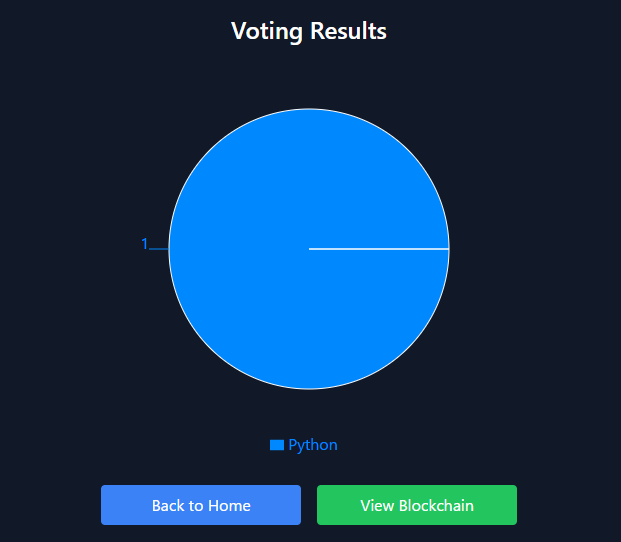

# Electronic Voting System (Blockchain-Based)

## Overview

This is a blockchain-based electronic voting system built as a personal project.  
The goal is to explore how blockchain can provide **security**, **transparency**, and **tamper resistance** in digital voting.

## Key Features

- **Digital Signature Verification**: Voters sign their vote using a private key; the backend verifies it using the corresponding public key.
- **Block-Based Storage**: Valid votes are grouped into blocks and linked via cryptographic hashes.
- **Tamper Detection**: The chain can be validated to detect any alteration in the vote history.
- **Simple UI**: React-based frontend allows users to generate key pairs, sign votes, and view blockchain data.

## Technologies

- **Frontend**: React + TypeScript + Vite
- **Backend**: FastAPI (Python)
- **Crypto**: ECDSA (Elliptic Curve Digital Signatures)
- **Utilities**: Python standard libraries (`hashlib`, `json`, `time`)

## Current Status

- UI ↔ Backend communication works  
- Votes are signed and verified properly  
- Blockchain grows with each validated vote  
- Duplicate vote prevention: *Planned*  
- Blockchain persistence: Implemented

## Screenshots

### Voting Interface

### Vote Results

## How to Use

1. Launch the backend (`docker-compose build && docker-compose up -d`)
2. Start the frontend (`cd frontend && npm install && npm run dev`)
3. Open the UI in your browser
4. Generate or load a key pair (stored in localStorage)
5. Select an option and vote — your vote is signed and sent to the backend
6. Backend verifies the signature and adds the vote to the blockchain

## Planned Improvements

- Enforce one vote per public key
- Enhance blockchain visualization
- Add unit tests and error handling
